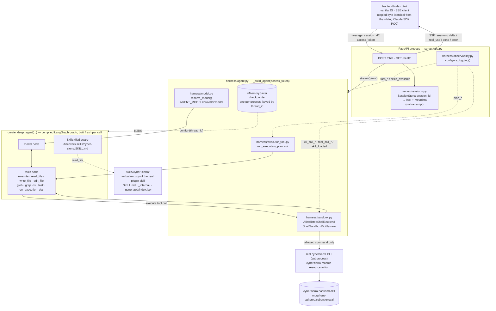
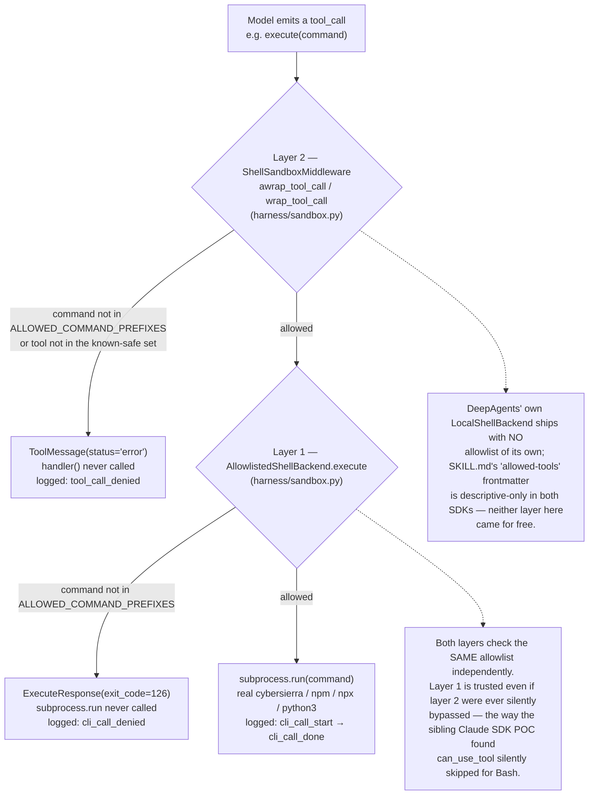
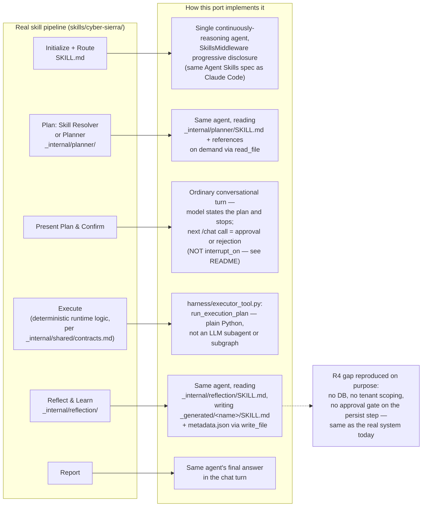
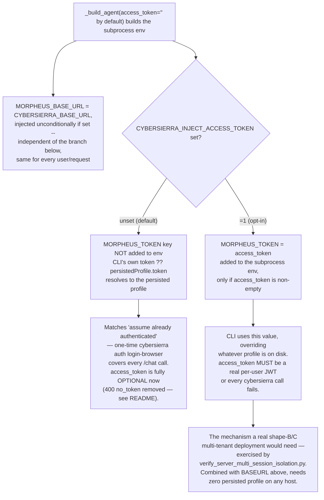

# Architecture — cybersierra CLI + DeepAgents SDK POC

Diagrams of what's actually built in this repo (see `README.md` for the
full explanation and verification evidence behind each piece). Five views:
system components, one `/chat` turn end to end, the two-layer shell
sandbox, how the real `cyber-sierra` skill pipeline maps onto DeepAgents
primitives, and the access-token decision that was fixed after the
"already logged in" question.

## 1. System components



## 2. One `/chat` turn, end to end

```mermaid
sequenceDiagram
    autonumber
    participant U as Browser (frontend/index.html)
    participant S as FastAPI (server/app.py)
    participant St as SessionStore (server/sessions.py)
    participant H as harness.agent.stream()
    participant G as DeepAgents graph (LangGraph)
    participant M as Chat model (Anthropic/OpenAI)
    participant Mw as ShellSandboxMiddleware
    participant B as AllowlistedShellBackend
    participant C as real cybersierra CLI

    U->>S: POST /chat (message, session_id?, access_token optional)
    alt session_id unknown to SessionStore
        S-->>U: 404 unknown_session
    else session already mid-turn
        S-->>U: 409 session_busy
    end
    S->>St: create()/get() then lock.acquire()
    S->>H: stream(prompt, access_token or "", session_id | resume)
    H->>H: _build_agent(access_token)<br/>fresh backend + middleware; shared checkpointer
    H->>G: astream_events(HumanMessage, config={thread_id})
    G->>M: model node (system prompt + skills catalogue in context)
    M-->>G: AIMessage with tool_calls, e.g. execute("cybersierra ...")
    G->>Mw: awrap_tool_call(request)
    Mw->>Mw: is_command_allowed(command)?
    alt allowed
        Mw->>B: handler(request) → backend.execute(command)
        B->>C: subprocess.run (real CLI)
        C-->>B: stdout / stderr / exit_code
        B-->>Mw: ExecuteResponse
    else denied
        Mw-->>G: ToolMessage(status="error") — handler never called
    end
    G->>M: model node again, with the tool result in context
    M-->>G: streamed AIMessageChunk deltas
    G-->>H: on_chat_model_stream / on_tool_start / on_chat_model_end events
    H-->>S: TextDelta / ToolUseStarted / Done (harness event vocabulary)
    S-->>U: SSE: delta* / tool_use* / done
    S->>St: lock.release()
```

## 3. Shell sandbox — two independent enforcement layers



## 4. Real `cyber-sierra` pipeline → DeepAgents primitives

The 7-phase pipeline in `skills/cyber-sierra/SKILL.md` (Initialize → Route
→ Plan → Present-Plan-&-Confirm → Execute → Reflect-&-Learn → Report) was
ported by mapping each phase onto whichever DeepAgents primitive actually
fit, not by forcing one subagent per phase — see `README.md` "Porting the
real pipeline" for the reasoning behind each choice below.



## 5. Access-token decision (default vs. injection mode)

Two sequential fixes, each caught by a direct question, not by testing:
(1) unconditionally injecting `access_token` into the subprocess env
overrode an already-authenticated `cybersierra auth login-browser` session
with a UI placeholder, since the CLI's `??` fallback only triggers on a
*missing* env var, not a wrong one — fixed by making injection opt-in;
(2) even opt-in, `access_token` was still a *required* `/chat` field for
no real reason in this POC's scope — fixed by dropping the requirement
entirely (`400 no_token` removed).

**Correction:** the diagram and prose below originally named the override
variable `CYBERSIERRA_TOKEN`. That was never correct — the real installed
CLI binary contains zero references to that string; the actual variable it
reads is `MORPHEUS_TOKEN` (confirmed by reading the binary's own
profile-resolution code and reproducing live — see README "Authentication
model" for the full correction). Fixed below.

**Second correction, added alongside the first:** the diagram below
originally implied `MORPHEUS_TOKEN` injection was the *only* thing needed
for a real deployment. It isn't — `MORPHEUS_BASE_URL` also has to resolve,
and nothing previously forwarded it to the subprocess at all (this repo's
own `CYBERSIERRA_BASE_URL` was dead config). Unlike token injection, this
is deployment-wide, not per-request, so it's injected unconditionally,
independent of the `CYBERSIERRA_INJECT_ACCESS_TOKEN` branch entirely — see
the new `BASEURL` node below and README "Authentication model" (Fix 3) for
the full story.


