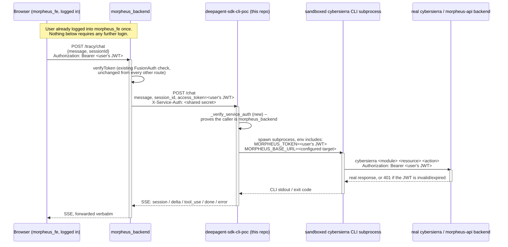

# Architecture: the full request path

## Before v2

Tracy (the chat widget in morpheus_fe) called this AI service **directly**
from the browser, cross-origin, bypassing morpheus_backend entirely. The
`access_token` it sent was hardcoded to an empty string — effectively
unauthenticated. This is the pattern every other AI feature in the product
(`super_search`, `dashboard_builder`) does *not* use — they all go through
morpheus_backend as a broker.

## After v2

## Why morpheus_backend is in the loop at all (not a pure pass-through)

- It's the only place that already validates the user's identity
  (`verifyToken`) and holds their real JWT server-side.
- It's where the service-to-service secret to this AI service is held —
  the browser never sees or needs it.
- It matches the existing pattern (`super_search`, `dashboard_builder`)
  instead of Tracy being the one feature that does something different.

## Why this AI service still shells out to a real CLI binary, not a direct API client

Out of scope to change for v2 — this was already the design (see this
repo's main `README.md` and `ARCHITECTURE.md` for the deep rationale: the
real `cyber-sierra` skill pipeline is ported verbatim and is built around
driving the real `cybersierra` CLI, mirroring what a human operator would
type). v2 only changes *how this service is reached and authenticated*,
not what it does once it's reached.

## What each repo actually got touched

| Repo | What changed | Detail |
|---|---|---|
| morpheus_fe | Tracy calls the backend instead of this service directly; mints its own session ID | [frontend-changes.md](frontend-changes.md) |
| morpheus_backend | New `tracy` module: a thin, stateless SSE proxy | [backend-changes.md](backend-changes.md) |
| deepagent-sdk-cli-poc (this repo) | Service-to-service auth, client-chosen session IDs, real per-user CLI identity, sandbox hardening | [ai-service-changes.md](ai-service-changes.md) |

## Diagnostic history worth knowing about

Two real, previously-undiscovered bugs were found and fixed while
verifying this wiring **live**, not by reading code and assuming it
worked:

1. The env var this service injected to make the CLI use a per-request
   identity was spelled wrong (`CYBERSIERRA_TOKEN` — the real CLI never
   reads that name at all; it's `MORPHEUS_TOKEN`). Silent no-op in every
   prior version of this repo.
2. Even with that fixed, a genuinely fresh deployment host (one that's
   never had a human interactively log in on it) still failed every
   command, because nothing forwarded a base URL to the CLI subprocess
   either — it was silently depending on a persisted login file that a
   real deployment would never have.

Both are detailed in full, with the actual reproduction commands and
output, in [auth-flow.md](auth-flow.md).
